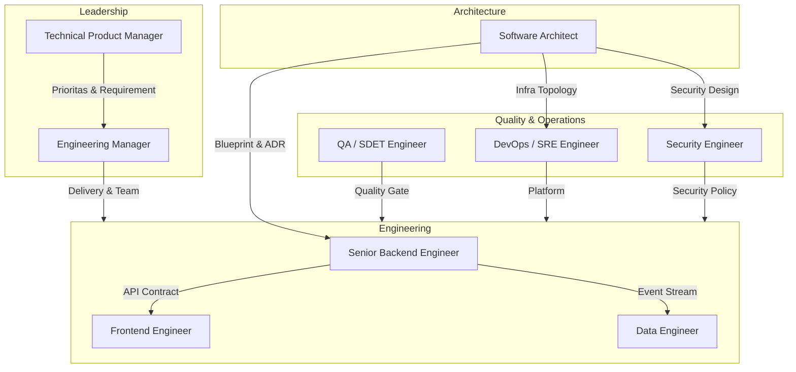

# 📚 Master Index: Peran-Peran Profesional Tim Engineering

Koleksi dokumentasi peran profesional dalam sebuah tim *software engineering* yang matang dan berkelas. Setiap dokumen mencakup tanggung jawab utama, tech stack, KPI, dan standar kerja di level perusahaan teknologi modern (startup Series B+ hingga unicorn/enterprise).

---

## 🏗️ Peran Teknis Individual (Individual Contributors)

| # | Dokumen | Deskripsi Singkat | Level |
|:---|:---|:---|:---|
| 1 | [🏛️ Software Architect](file:///Users/kurniawanpras/.gemini/antigravity-ide/brain/4e6aae6e-9baf-46fc-b2b8-1703c35818d1/peran_software_architect.md) | Perancang cetak biru sistem, microservices, & distributed systems | Principal — Distinguished |
| 2 | [⚙️ Senior Backend Engineer](file:///Users/kurniawanpras/.gemini/antigravity-ide/brain/4e6aae6e-9baf-46fc-b2b8-1703c35818d1/peran_senior_backend_engineer.md) | Eksekutor handal: query optimizer, MQ master, performa "level dewa" | Senior — Staff |
| 3 | [🎨 Frontend Engineer](file:///Users/kurniawanpras/.gemini/antigravity-ide/brain/4e6aae6e-9baf-46fc-b2b8-1703c35818d1/peran_frontend_engineer.md) | Pembangun antarmuka: performance, accessibility, & design system | Junior — Senior — Staff |
| 4 | [🚀 DevOps / SRE Engineer](file:///Users/kurniawanpras/.gemini/antigravity-ide/brain/4e6aae6e-9baf-46fc-b2b8-1703c35818d1/peran_devops_sre_engineer.md) | Infrastruktur as Code, CI/CD pipeline, Kubernetes, reliability | Mid — Senior |
| 5 | [🔐 Security Engineer (AppSec)](file:///Users/kurniawanpras/.gemini/antigravity-ide/brain/4e6aae6e-9baf-46fc-b2b8-1703c35818d1/peran_security_engineer.md) | Threat modeling, SAST/DAST, Zero-Trust, incident response | Mid — Senior |
| 6 | [✅ QA / SDET Engineer](file:///Users/kurniawanpras/.gemini/antigravity-ide/brain/4e6aae6e-9baf-46fc-b2b8-1703c35818d1/peran_qa_sdet_engineer.md) | Test automation, quality architecture, performance testing | Mid — Senior |
| 7 | [🔢 Data Engineer](file:///Users/kurniawanpras/.gemini/antigravity-ide/brain/4e6aae6e-9baf-46fc-b2b8-1703c35818d1/peran_data_engineer.md) | ETL/ELT pipeline, data warehouse, streaming data, data quality | Mid — Senior |

---

## 👥 Peran Kepemimpinan & Produk

| # | Dokumen | Deskripsi Singkat | Level |
|:---|:---|:---|:---|
| 8 | [📋 Engineering Manager](file:///Users/kurniawanpras/.gemini/antigravity-ide/brain/4e6aae6e-9baf-46fc-b2b8-1703c35818d1/peran_engineering_manager.md) | Kepemimpinan tim: orang, proses, delivery, culture | Manager — Senior Manager |
| 9 | [🎯 Technical Product Manager](file:///Users/kurniawanpras/.gemini/antigravity-ide/brain/4e6aae6e-9baf-46fc-b2b8-1703c35818d1/peran_technical_product_manager.md) | Jembatan bisnis & teknis: roadmap, PRD, data-driven decisions | PM — Senior PM — Principal PM |

---

## 🧭 Diagram Kolaborasi Antar Peran

---

## 📊 Matriks Perbandingan Peran (Cepat)

| Peran | Coding Intensity | Meeting Intensity | Technical Depth | Business Impact |
|:---|:---:|:---:|:---:|:---:|
| Software Architect | 🟡 Medium | 🟠 High | 🔴 Sangat Tinggi | 🔴 Sangat Tinggi |
| Senior Backend Engineer | 🔴 Sangat Tinggi | 🟢 Low | 🔴 Sangat Tinggi | 🟠 High |
| Frontend Engineer | 🔴 Sangat Tinggi | 🟡 Medium | 🟠 High | 🟠 High |
| DevOps/SRE | 🟠 High | 🟡 Medium | 🔴 Sangat Tinggi | 🔴 Sangat Tinggi |
| Security Engineer | 🟠 High | 🟡 Medium | 🔴 Sangat Tinggi | 🟠 High |
| QA Engineer | 🟠 High | 🟡 Medium | 🟠 High | 🟠 High |
| Data Engineer | 🔴 Sangat Tinggi | 🟢 Low | 🟠 High | 🟠 High |
| Engineering Manager | 🟢 Low | 🔴 Sangat Tinggi | 🟡 Medium | 🔴 Sangat Tinggi |
| Technical PM | 🟢 Low | 🔴 Sangat Tinggi | 🟡 Medium | 🔴 Sangat Tinggi |

---

*Dokumen ini berfungsi sebagai referensi standar tim engineering SIPZIS-LAZISMU-BANTEN untuk memahami tanggung jawab, ekspektasi, dan kolaborasi antar peran secara profesional.*
